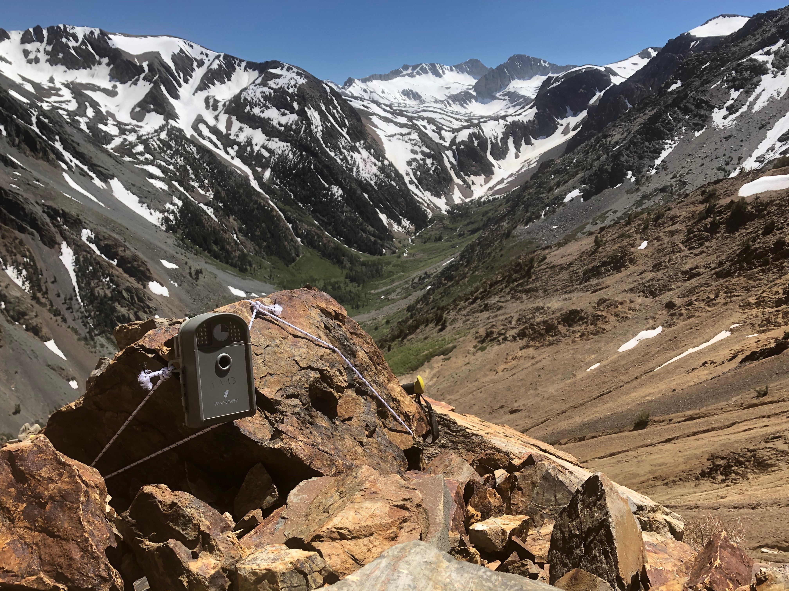
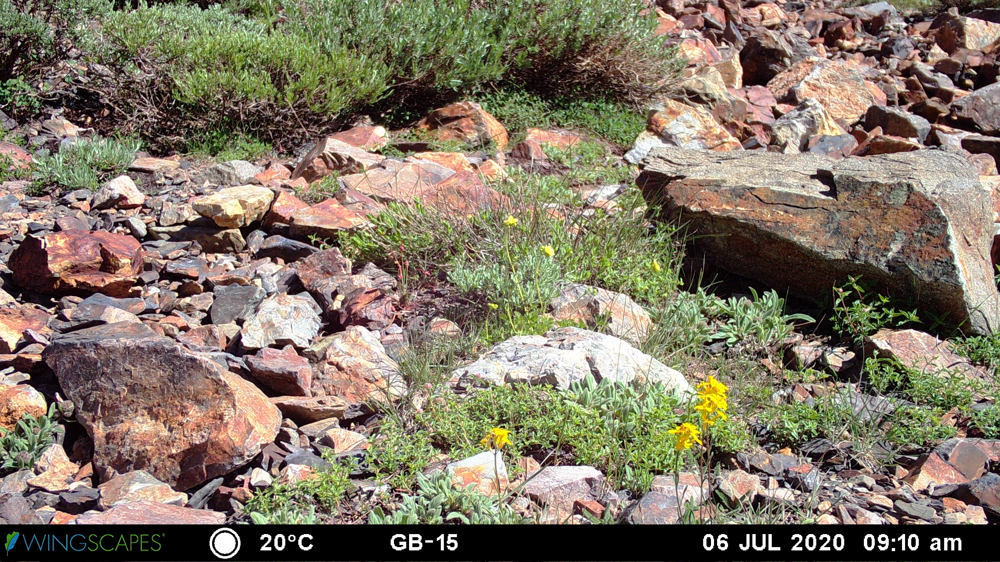
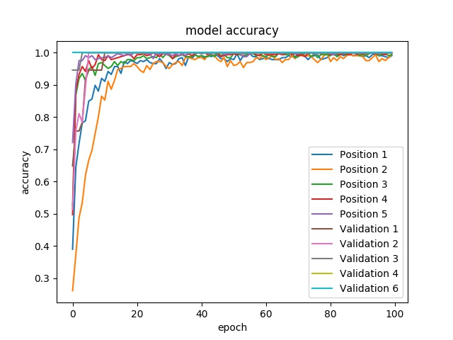
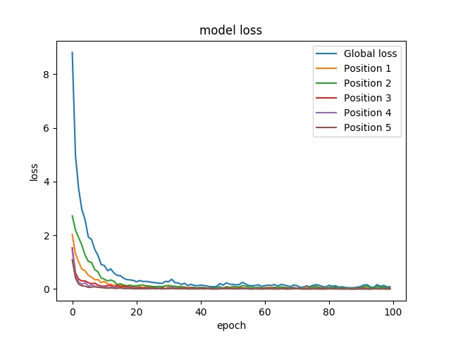

# tempKeras
Keras method for extracting temperature from image info bar

## Background

I, like many ecologists, use remote cameras in the field. Many folks use [camera traps](https://emammal.si.edu/) to monitor wildlife populations, and others use [digital repeat photography](https://phenocam.sr.unh.edu/webcam/) (time-lapse) to focus on seasonal changes in the environment. In practice, remote photography often yields datasets of thousands or even millions of images. You can probably imagine how quickly the workload of photo management and analysis quickly piles up. 

## Motivation

The time-lapse camera model I use in the field imprints the temperature on an info bar at the bottom of the photo. This is super convenient when studying plant and snow phenology, because these things tend to covary with temperature (among other things). Unfortunately, while the temperature is imprinted in the photograph, that data is not stored in the image's .exif metadata. So, while it's simple to programatically access things like the timestamp or exposure settings of an image, it is not so easy to access temperature information. I decided to put together a convolutional neural network to read the temperature from my time-lapse images. The goal was to be able to input a series of images and produce a table of filenames with associated temperature measurements.

Another motivating factor was that many of the digit detection and classification algorithms currently available run in Python 2.7. I upgraded to Python 3.x a while back, and therefore needed a new approach.

## The application

### Generating training data
I used a python script to crop a year's worth of imagery from one camera to just the region occupied by the temperature stamp. The CNN will ultimately be dealing with predicting 5 separate values in a sequence. Each cropped image was given a unique filename and stored in one common subdirectory for training imagery. Then I created a spreadsheet that had a column for filename, and one column for each of the 5 positions that would be evaluated. Digit columns were filled according to whatever value was in that position of that image.

This application is simpler than other computer vision tasks, because the location where the temperature data is imprinted is consistent across every image. So, there's no need for a computer to search an image for numbers. By defining the bounding box for where temperature "lives" in the image, I crop away all of the "uninteresting" parts of the picture (uninteresting for this application - I'd much rather look at pictures of plants than temperature values; hence, training a computer to do it for me). For the digit classification step, we know there are only certain values that can occupy each position in the temperature reading: the numbers 0-9, ' ' (indicating blank space), '°', 'C', and '-' (negative temperatures are frequent in moutains). Each of these is converted into a numeric class for training, testing, and generating model predictions. I used the values 0-9 to correspond with '0'-'9', 10 for ' ', 11 for '°', 12 for 'C', and 13 for '-'. Certain conventions exist around the order of these classes (for example, '-' is always first when present, and '°' is always followed by 'C'), further facilitating the training of the network.

### Training the CNN
A keras convolutional neural network was trained by stacking two conv2D layers, followed by a flattening step, a large dense layer, and then 5 positional dense layers that correspond with each of the 5 positions for which digits will be analyzed. I included several dropout layers to avoid overfitting, but given the consistency of the temperature stamp in imagery, I'm not sure if those were necessary. I also trained the model for far longer than necessary (100 epochs); you can see from the accuracy plots that it performed exquisitely on the validation data after only a few epochs. The core of the CNN structure was inspired by Sajal Sharma's work [here](https://sajalsharma.com/portfolio/digit_sequence_recognition).

## Implementation

Clone the repository and navigate to the folder:

`$ cd PATH/TO/DIR/`

Then use the train script to train the model:

`$ python3 temp_conv2d_train.py .`

Generate predictions from the trained model using the predcit script with the following syntax:

`$ python3 temp_conv2d_predict.py test .`

A .csv predicted temperature file will be generated and saved in the image directory.
